# SyFB_GitHub
一种有一堆~~没用~~想法，但不知道实现了多少的小透明

当然，我的 ID 可以简称为 SyFB ，在一些地方我也会用简写的 ID，或许可以读作 site ~~但是这两者真的一点关系也没有啊啊啊啊啊啊啊啊啊啊~~

~~我真的太喜欢为我的项目加 SyFB_ 前缀了 lollollollol~~

以下的所有卡片每天 UTC 0:00 更新，所以可能会有更新不及时的情况


## 成分表
### 游戏
- Minecraft ~~(我的 P2P 联机呢)~~
- deltarune (不含 UNDERTALE) ~~(吊→塔↘润↑↑↑ (Ch5 开场))~~
- osu! ~~(Welcome to osuuuuuuuu)~~
- (曾经的) Phigros

### 音乐
- 主要是音游曲，当然电子的也会听点
- MC / dr / UT 的 OST
- 没了没了没了 (((())

### 设计
- 传统 UI 上 (Win32, QtWidgets) 我会设计得偏紧凑，防止小屏幕没法显示完整窗口
- 现在喜欢 [Material Design](https://m3.material.io/)，当然微软 ~~(巨硬)~~ 的 [Fluent Design](https://fluent2.microsoft.design/) 也很不错
- 除此之外，图标之类的元素几乎都来自 [IconPark](https://iconpark.oceanengine.com/home)
    - 自己不会捏 (悲)
- 以前图像资源创作较常用的是 Photoshop，不过现在 Krita 用得比较多
    - GIMP 也用一点，不过界面与前两者区别较大所以对于我来说很难上手 (
    - Inkscape 还不错，或许对于矢量设计有点帮助？

### 开发
- 较偏好一些去中心化的 (Matrix, Gitea 等)
    - 开服？还不错，但是没 $ 开不了，先 Github Pages 用着吧
- 一般开发 FOSS (Free and Open Source Software) 软件
- 一般情况下最好不选 GPL，虽然 GNU 项目的质量很高

### OI
- 蒟蒻，没别的

### AI ...?
- 能不用最好不用，搜索引擎使用得较多
- 这群 商业AI 真是让我火大 ...
    - 我是正牌的&ensp;&ensp;&ensp;&ensp;&ensp;&ensp;&ensp;&ensp;Starwalker
    - [梗出处](https://zh.deltarune.wiki/w/Starwalker)
    - ~~不是我颜色呢~~
- 所以，我一般 DeepSeek 用得较多，如果要识图，或者 Ollama，就会斟酌地用一点千问

## 指代
- 一般用 they / them，中文下用ta
- he / him / 他 是现实中的，但是我不太喜欢用，也不建议其他人用，除非是在极正式的场合
- 貌似其他代词也行 ...?

## 常用工具
- [Arch Linux](https://archlinux.org/) - 比较适合我这种喜欢新鲜事物的开发者，但这并不意味着我不接纳其它发行版！
  - 在一些我不常用的平台上照样能找到 [Fedora](https://fedoraproject.org/) 和 [Debian](https://www.debian.org/) 的身影
- [Neovim](https://neovim.io/) - ~~被它的配置折磨得不轻~~，但它还是我的常用编辑器之一
- [MSYS2](https://www.msys2.org/) - 在 Windows 上可以用它代替 MSVC ，Windows 开发几乎靠它，所以我一般不会去考虑 MSVC 的情况
- DE / WM
  - [KDE](https://kde.org/) - 不想折腾时我的首选桌面环境
- [niri](https://github.com/niri-wm/niri) - ~~但我的 KDE 心始终不改~~
- [Matrix](https://matrix.org/) - (官网国内打不开) 较常用的 IM 之一，我喜欢它去中心化的特性

## 常用语言
- Python (除了慢别的都好)
- Rust (在 C++ 和 Python 之间做到了平衡，但是编译后程序体积较大)
- Bash / Fish (Windows 的 Batch 写的较少因为 [busybox-w32](https://github.com/rmyorston/busybox-w32) 以及 [MSYS2](https://www.msys2.org/) 可以运行 Linux / *BSD 上的脚本语言)
- C++ (不太想用它，因为需要写较多的平台特定代码，而且我不太会写 CMake / Meson ~~，更别提 Autotools 了~~)
- Java (纯放水，Mod都是用MCr写的，很烂)
- 别的，比如 HTML ，但是都不太会


## 项目
目前已经构思了 NaN 个项目了，其中一些比较大的还是 WIP 或者压根不管 (比如 CamMonitor)  
注意，这里的大部分仓库维护频率都极低，特别是一些 CI 仓库可能工作流都没开

### 工具链
[](https://github.com/SystemFileB/mcdk)

### CI 仓库
[](https://github.com/SystemFileB/cpython-builder)
[](https://github.com/SystemFileB/libui-ng-windows-builder)
[](https://github.com/SystemFileB/n2n-mingw64)
[](https://github.com/SystemFileB/nginx-rtmp)

### Python 程序 / 库

[](https://github.com/SystemFileB/all-of-resources)
[](https://github.com/SystemFileB/mctoast)
[](https://github.com/SystemFileB/CamMonitor_Server)

### 未来的项目？
- [Hartrix](https://github.com/Hartrix) - 一个基于 Linux 硬件的 Matrix 客户端
- [Pluginful / PluginMC](https://github.com/Pluginful) - 通过插件打造一个属于你的应用！

### 模组
把这个放在最下面是因为我一般都不会去管它

[](https://github.com/SystemFileB/SyFB_Strange)

### LGPLv3 中文许可证翻译的来源
我有一些较老的项目用到了LGPLv3，包含了中文的非正式翻译文本，它们曾经来自 [这里](https://www.gnu.org/licenses/translations.html) 的链接  
但是，原链接已经失效，[时光机](https://web.archive.org/web/20241209221706/https://licenses.peaksol.org/lgplv3-zh.html) 上有 2024.12.09 的留档，不过 [2026.02.09 的留档](https://web.archive.org/web/20260209080752/https://licenses.peaksol.org/lgplv3-zh.html) 也指向了 [新链接](https://haydenwu.org/license-translations/lgplv3-zh/) ，但我还不能保证这两个地方写的许可证是一样的
我因为没时间维护那些项目，所以才写到主页上

## 传送门
[《个人主页》](https://systemfileb.github.io/home) | [哔哩哔哩](https://space.bilibili.com/1376977060) | [Gitee](https://gitee.com/SystemFileB) | [爱发电](https://afdian.com/a/systemfileb) | [Modrinth](https://modrinth.com/user/SystemFileB) | [Crowdin](https://zh.crowdin.com/profile/SystemFileB) | [KOOK 服务器](https://kook.vip/vmwMs8) | [Discord 服务器](https://discord.gg/P93nwYxWmQ) | [洛谷](https://www.luogu.com.cn/user/2081639) | [osu!](https://osu.ppy.sh/users/39872263)

---
END \~(￣▽￣)\~*  
~~有了 [这个仓库](https://github.com/aoguai/rime_kaomoji_dict) 再也不用担心 Fcitx 5 的颜文字太少啦 σ(=⌒ー⌒=)>~~

~~所以我一共写了多少个删除线~~
